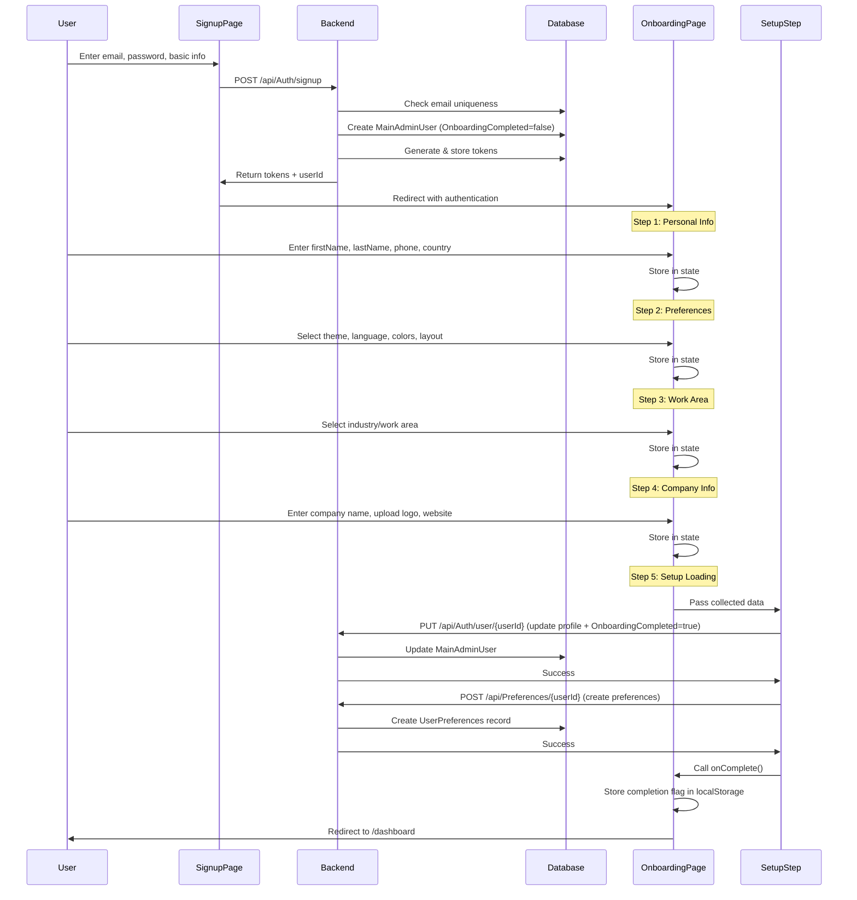

# Complete Signup & Onboarding Flow Analysis

## 📋 Table of Contents
1. [Overview](#overview)
2. [Database Schema](#database-schema)
3. [Backend APIs](#backend-apis)
4. [Frontend Flow](#frontend-flow)
5. [Complete Integration Flow](#complete-integration-flow)
6. [Current Implementation Issues](#current-implementation-issues)
7. [Recommended Implementation](#recommended-implementation)
8. [Data Flow Diagrams](#data-flow-diagrams)

---

## Overview

This document provides a deep analysis of the **signup → onboarding → preferences** flow, covering both backend APIs and frontend implementation to ensure perfect integration.

### Key Components

- **MainAdminUsers Table**: Primary user accounts (admins)
- **Users Table**: Secondary users (regular staff)
- **UserPreferences Table**: User-specific preferences linked to MainAdminUsers
- **Auth Module**: Handles signup, login, token management
- **Preferences Module**: Manages user preferences
- **Onboarding UI**: Multi-step wizard collecting user data

---

## Database Schema

### MainAdminUsers Table
```sql
CREATE TABLE "MainAdminUsers" (
    "Id" SERIAL PRIMARY KEY,
    "Email" VARCHAR(255) NOT NULL UNIQUE,
    "PasswordHash" VARCHAR(255) NOT NULL,
    "FirstName" VARCHAR(100) NOT NULL,
    "LastName" VARCHAR(100) NOT NULL,
    "PhoneNumber" VARCHAR(20),
    "Country" VARCHAR(2) NOT NULL,
    "Industry" VARCHAR(100) NOT NULL DEFAULT '',
    "AccessToken" VARCHAR(500),
    "RefreshToken" VARCHAR(500),
    "TokenExpiresAt" TIMESTAMP,
    "CreatedAt" TIMESTAMP NOT NULL DEFAULT CURRENT_TIMESTAMP,
    "UpdatedAt" TIMESTAMP,
    "IsActive" BOOLEAN NOT NULL DEFAULT TRUE,
    "LastLoginAt" TIMESTAMP,
    "CompanyName" VARCHAR(255),
    "CompanyWebsite" VARCHAR(500),
    "PreferencesJson" TEXT,  -- Legacy JSON field (not recommended for new implementations)
    "OnboardingCompleted" BOOLEAN NOT NULL DEFAULT FALSE
);
```

### UserPreferences Table
```sql
CREATE TABLE "UserPreferences" (
    "Id" VARCHAR(50) PRIMARY KEY DEFAULT gen_random_uuid()::text,
    "UserId" INTEGER NOT NULL,
    "Theme" VARCHAR(20) NOT NULL DEFAULT 'system',
    "Language" VARCHAR(5) NOT NULL DEFAULT 'en',
    "PrimaryColor" VARCHAR(20) NOT NULL DEFAULT 'blue',
    "LayoutMode" VARCHAR(20) NOT NULL DEFAULT 'sidebar',
    "DataView" VARCHAR(10) NOT NULL DEFAULT 'table',
    "Timezone" VARCHAR(100),
    "DateFormat" VARCHAR(20) NOT NULL DEFAULT 'MM/DD/YYYY',
    "TimeFormat" VARCHAR(5) NOT NULL DEFAULT '12h',
    "Currency" VARCHAR(5) NOT NULL DEFAULT 'USD',
    "NumberFormat" VARCHAR(10) NOT NULL DEFAULT 'comma',
    "Notifications" TEXT DEFAULT '{}',
    "SidebarCollapsed" BOOLEAN NOT NULL DEFAULT FALSE,
    "CompactMode" BOOLEAN NOT NULL DEFAULT FALSE,
    "ShowTooltips" BOOLEAN NOT NULL DEFAULT TRUE,
    "AnimationsEnabled" BOOLEAN NOT NULL DEFAULT TRUE,
    "SoundEnabled" BOOLEAN NOT NULL DEFAULT TRUE,
    "AutoSave" BOOLEAN NOT NULL DEFAULT TRUE,
    "WorkArea" VARCHAR(100),
    "DashboardLayout" TEXT,
    "QuickAccessItems" TEXT DEFAULT '[]',
    "CreatedAt" TIMESTAMP NOT NULL DEFAULT CURRENT_TIMESTAMP,
    "UpdatedAt" TIMESTAMP NOT NULL DEFAULT CURRENT_TIMESTAMP,
    FOREIGN KEY ("UserId") REFERENCES "MainAdminUsers"("Id") ON DELETE CASCADE
);
```

**Key Relationships:**
- `UserPreferences.UserId` → `MainAdminUsers.Id` (CASCADE DELETE)
- One-to-One relationship (one user has one preferences record)

---

## Backend APIs

### 1. Auth Module - Signup

#### Endpoint
```
POST /api/Auth/signup
```

#### Request DTO
```csharp
public class SignupRequestDto
{
    [Required, EmailAddress]
    public string Email { get; set; }
    
    [Required, MinLength(6)]
    public string Password { get; set; }
    
    [Required, MaxLength(100)]
    public string FirstName { get; set; }
    
    [Required, MaxLength(100)]
    public string LastName { get; set; }
    
    [MaxLength(20)]
    public string? PhoneNumber { get; set; }
    
    [Required, MaxLength(2)]
    public string Country { get; set; }
    
    [Required, MaxLength(100)]
    public string Industry { get; set; }
    
    [MaxLength(255)]
    public string? CompanyName { get; set; }
    
    [MaxLength(500)]
    public string? CompanyWebsite { get; set; }
    
    public string? Preferences { get; set; } // JSON string (legacy field)
}
```

#### Response DTO
```csharp
public class AuthResponseDto
{
    public bool Success { get; set; }
    public string Message { get; set; }
    public string? AccessToken { get; set; }
    public string? RefreshToken { get; set; }
    public DateTime? ExpiresAt { get; set; }
    public UserDto? User { get; set; }
}

public class UserDto
{
    public int Id { get; set; }
    public string Email { get; set; }
    public string FirstName { get; set; }
    public string LastName { get; set; }
    public string? PhoneNumber { get; set; }
    public string Country { get; set; }
    public string Industry { get; set; }
    public string? CompanyName { get; set; }
    public string? CompanyWebsite { get; set; }
    public string? Preferences { get; set; }
    public DateTime CreatedAt { get; set; }
    public DateTime? LastLoginAt { get; set; }
    public bool OnboardingCompleted { get; set; }
}
```

#### Implementation Logic (AuthService.cs)
```csharp
public async Task<AuthResponseDto> SignupAsync(SignupRequestDto signupDto)
{
    // 1. Check email uniqueness in MainAdminUsers
    var existingAdminUser = await _context.MainAdminUsers
        .FirstOrDefaultAsync(u => u.Email.ToLower() == signupDto.Email.ToLower());
    if (existingAdminUser != null)
        return new AuthResponseDto { Success = false, Message = "User already exists" };

    // 2. Check email uniqueness in Users table (regular users)
    var existingRegularUser = await _context.Users
        .FirstOrDefaultAsync(u => u.Email.ToLower() == signupDto.Email.ToLower() && !u.IsDeleted);
    if (existingRegularUser != null)
        return new AuthResponseDto { Success = false, Message = "User already exists" };

    // 3. Hash password (BCrypt with salt 12)
    var hashedPassword = HashPassword(signupDto.Password);
    
    // 4. Create new MainAdminUser
    var newUser = new MainAdminUser
    {
        Email = signupDto.Email.ToLower(),
        PasswordHash = hashedPassword,
        FirstName = signupDto.FirstName,
        LastName = signupDto.LastName,
        PhoneNumber = signupDto.PhoneNumber,
        Country = signupDto.Country,
        Industry = signupDto.Industry,
        CompanyName = signupDto.CompanyName,
        CompanyWebsite = signupDto.CompanyWebsite,
        PreferencesJson = signupDto.Preferences,  // Legacy field
        CreatedAt = DateTime.UtcNow,
        IsActive = true,
        OnboardingCompleted = false  // Will be updated later
    };

    _context.MainAdminUsers.Add(newUser);
    await _context.SaveChangesAsync();

    // 5. Generate JWT tokens
    var (accessToken, refreshToken, expiresAt) = GenerateTokensAsync(newUser);

    // 6. Update user with tokens
    newUser.AccessToken = accessToken;
    newUser.RefreshToken = refreshToken;
    newUser.TokenExpiresAt = expiresAt;
    newUser.LastLoginAt = DateTime.UtcNow;
    await _context.SaveChangesAsync();

    // 7. Return response with tokens and user data
    return new AuthResponseDto
    {
        Success = true,
        Message = "Account created successfully",
        AccessToken = accessToken,
        RefreshToken = refreshToken,
        ExpiresAt = expiresAt,
        User = MapToUserDto(newUser)
    };
}
```

**Security Features:**
- BCrypt password hashing with salt rounds = 12
- JWT token generation with RS256 algorithm
- Email uniqueness validation across both user tables
- Automatic token generation and storage
- Case-insensitive email comparison

---

### 2. Auth Module - Update User

#### Endpoint
```
PUT /api/Auth/user/{userId}
```

**Purpose**: Update user profile information after signup (used during onboarding)

#### Request DTO
```csharp
public class UpdateUserRequestDto
{
    [MaxLength(100)]
    public string? FirstName { get; set; }
    
    [MaxLength(100)]
    public string? LastName { get; set; }
    
    [MaxLength(20)]
    public string? PhoneNumber { get; set; }
    
    [MaxLength(2)]
    public string? Country { get; set; }
    
    [MaxLength(100)]
    public string? Industry { get; set; }
    
    [MaxLength(255)]
    public string? CompanyName { get; set; }
    
    [MaxLength(500)]
    public string? CompanyWebsite { get; set; }
    
    public string? Preferences { get; set; }
    
    public bool? OnboardingCompleted { get; set; }  // KEY FIELD for onboarding
}
```

#### Example Request
```json
{
  "firstName": "John",
  "lastName": "Doe",
  "phoneNumber": "+1234567890",
  "country": "US",
  "industry": "Technology",
  "companyName": "Tech Corp",
  "companyWebsite": "https://techcorp.com",
  "onboardingCompleted": true
}
```

---

### 3. Preferences Module - Create Preferences

#### Endpoint
```
POST /api/Preferences/{userId}
```

**Purpose**: Create user preferences record (should be called during onboarding)

#### Request DTO
```csharp
public class CreatePreferencesRequest
{
    [Required]
    public string Theme { get; set; } = "system";  // 'light' | 'dark' | 'system'
    
    [Required]
    public string Language { get; set; } = "en";
    
    [Required]
    public string PrimaryColor { get; set; } = "blue";
    
    [Required]
    public string LayoutMode { get; set; } = "sidebar";  // 'sidebar' | 'topbar'
    
    [Required]
    public string DataView { get; set; } = "table";  // 'table' | 'list' | 'grid'
    
    public string? Timezone { get; set; }
    public string DateFormat { get; set; } = "MM/DD/YYYY";
    public string TimeFormat { get; set; } = "12h";
    public string Currency { get; set; } = "USD";
    public string NumberFormat { get; set; } = "comma";
    public string? Notifications { get; set; } = "{}";
    public bool? SidebarCollapsed { get; set; }
    public bool? CompactMode { get; set; }
    public bool? ShowTooltips { get; set; }
    public bool? AnimationsEnabled { get; set; }
    public bool? SoundEnabled { get; set; }
    public bool? AutoSave { get; set; }
    public string? WorkArea { get; set; }
    public string? DashboardLayout { get; set; }
    public string? QuickAccessItems { get; set; }
}
```

#### Implementation Logic (PreferencesService.cs)
```csharp
public async Task<PreferencesResponse> CreateUserPreferencesAsync(string userId, CreatePreferencesRequest request)
{
    // 1. Validate userId format
    if (!int.TryParse(userId, out int userIdInt))
        throw new ArgumentException("Invalid user ID format");
    
    // 2. Check if preferences already exist (prevent duplicates)
    var existingPreferences = await _context.UserPreferences
        .FirstOrDefaultAsync(p => p.UserId == userIdInt);
    
    if (existingPreferences != null)
        throw new InvalidOperationException("User preferences already exist. Use update instead.");

    // 3. Create preferences with validation
    var preferences = new UserPreferences
    {
        UserId = userIdInt,
        Theme = ValidateAndDefault(request.Theme, "system", 20),
        Language = ValidateAndDefault(request.Language, "en", 5),
        PrimaryColor = ValidateAndDefault(request.PrimaryColor, "blue", 20),
        LayoutMode = ValidateAndDefault(request.LayoutMode, "sidebar", 20),
        DataView = ValidateAndDefault(request.DataView, "table", 10),
        Timezone = ValidateString(request.Timezone, 100),
        DateFormat = ValidateAndDefault(request.DateFormat, "MM/DD/YYYY", 20),
        TimeFormat = ValidateAndDefault(request.TimeFormat, "12h", 5),
        Currency = ValidateAndDefault(request.Currency, "USD", 5),
        NumberFormat = ValidateAndDefault(request.NumberFormat, "comma", 10),
        Notifications = request.Notifications ?? "{}",
        SidebarCollapsed = request.SidebarCollapsed ?? false,
        CompactMode = request.CompactMode ?? false,
        ShowTooltips = request.ShowTooltips ?? true,
        AnimationsEnabled = request.AnimationsEnabled ?? true,
        SoundEnabled = request.SoundEnabled ?? true,
        AutoSave = request.AutoSave ?? true,
        WorkArea = ValidateString(request.WorkArea, 100),
        DashboardLayout = request.DashboardLayout,
        QuickAccessItems = request.QuickAccessItems ?? "[]",
        CreatedAt = DateTime.UtcNow,
        UpdatedAt = DateTime.UtcNow
    };

    _context.UserPreferences.Add(preferences);
    await _context.SaveChangesAsync();

    return MapToPreferencesResponse(preferences);
}
```

#### Example Request
```json
{
  "theme": "dark",
  "language": "en",
  "primaryColor": "blue",
  "layoutMode": "sidebar",
  "dataView": "table",
  "timezone": "America/New_York",
  "dateFormat": "MM/DD/YYYY",
  "timeFormat": "12h",
  "currency": "USD",
  "numberFormat": "comma",
  "workArea": "Technology",
  "sidebarCollapsed": false,
  "compactMode": false,
  "showTooltips": true,
  "animationsEnabled": true,
  "soundEnabled": true,
  "autoSave": true
}
```

---

### 4. Preferences Module - Update Preferences

#### Endpoint
```
PUT /api/Preferences/{userId}
```

#### Request DTO
```csharp
public class UpdatePreferencesRequest
{
    // All fields are optional (nullable)
    public string? Theme { get; set; }
    public string? Language { get; set; }
    public string? PrimaryColor { get; set; }
    public string? LayoutMode { get; set; }
    public string? DataView { get; set; }
    public string? Timezone { get; set; }
    public string? DateFormat { get; set; }
    public string? TimeFormat { get; set; }
    public string? Currency { get; set; }
    public string? NumberFormat { get; set; }
    public string? Notifications { get; set; }
    public bool? SidebarCollapsed { get; set; }
    public bool? CompactMode { get; set; }
    public bool? ShowTooltips { get; set; }
    public bool? AnimationsEnabled { get; set; }
    public bool? SoundEnabled { get; set; }
    public bool? AutoSave { get; set; }
    public string? WorkArea { get; set; }
    public string? DashboardLayout { get; set; }
    public string? QuickAccessItems { get; set; }
}
```

---

## Frontend Flow

### Onboarding Component Structure

```
src/modules/onboarding/
├── pages/
│   └── Onboarding.tsx                    # Main onboarding wizard
├── components/
│   ├── PersonalInfoStep.tsx              # Step 1: Name, phone, country
│   ├── PreferencesStep.tsx               # Step 2: Theme, language, colors
│   ├── WorkAreaStep.tsx                  # Step 3: Industry selection
│   ├── CompanyInfoStep.tsx               # Step 4: Company name, logo, website
│   └── SetupLoadingStep.tsx              # Step 5: Processing & API calls
└── hooks/
    └── useOnboardingTranslations.ts
```

### Onboarding Data Interface

```typescript
export interface OnboardingData {
  personalInfo: {
    firstName: string;
    lastName: string;
    phone?: string;
    country: string;
  };
  preferences: {
    theme: 'light' | 'dark' | 'system';
    language: string;
    primaryColor: string;
    layoutMode: 'sidebar' | 'topbar';
    dataView: 'table' | 'list' | 'grid';
  };
  workArea: string;  // Maps to Industry field
  companyInfo?: {
    name?: string;
    logo?: File | string | null;  // File during upload, data URL for persistence
    website?: string;
  };
}
```

### Current Frontend Implementation

#### Step Flow (Onboarding.tsx)
```typescript
const steps = [
  { component: PersonalInfoStep, title: "Personal Information" },      // Step 0
  { component: PreferencesStep, title: "Preferences" },                // Step 1
  { component: WorkAreaStep, title: "Work Area" },                     // Step 2
  { component: CompanyInfoStep, title: "Company Information" },        // Step 3
  { component: SetupLoadingStep, title: "Setting up..." }              // Step 4
];
```

#### handleComplete Flow
```typescript
const handleComplete = async () => {
  console.log('[Onboarding] handleComplete called');
  
  // Mark onboarding as completed on the server
  const { authService } = await import('@/services/authService');
  await authService.markOnboardingCompleted();

  // Save locally
  localStorage.setItem('onboarding-completed', 'true');
  localStorage.setItem('user-onboarding-data', JSON.stringify(data));

  // Persist PDF settings/logo if provided
  try {
    const storedPdf = localStorage.getItem('pdf-settings');
    const pdfSettings = storedPdf ? JSON.parse(storedPdf) : null;
    const companyLogo = data.companyInfo?.logo;
    if (companyLogo && typeof companyLogo === 'string') {
      const base = pdfSettings || {
        company: { name: data.companyInfo?.name || '' },
        showElements: { logo: true }
      };
      base.company = { ...base.company, logo: companyLogo };
      localStorage.setItem('pdf-settings', JSON.stringify(base));
    }
  } catch (err) {
    console.error('Failed to persist pdf-settings:', err);
  }

  navigate('/dashboard', { replace: true });
};
```

### SetupLoadingStep Component

**Current Implementation**: Stores data to localStorage only (NO API CALLS)

```typescript
export const SetupLoadingStep = ({ data, onComplete }: SetupLoadingStepProps) => {
  const setupSteps = [
    { id: 'profile', label: 'Setting up profile' },
    { id: 'preferences', label: 'Configuring preferences' },
    { id: 'workspace', label: 'Preparing workspace' }
  ];

  useEffect(() => {
    const processSteps = async () => {
      for (const step of setupSteps) {
        if (step.id === 'profile') {
          // Store profile data locally
          const userData = localStorage.getItem('user_data');
          if (userData) {
            const user = JSON.parse(userData);
            const updatedUser = {
              ...user,
              firstName: data.personalInfo.firstName,
              lastName: data.personalInfo.lastName,
              phoneNumber: data.personalInfo.phone,
              country: data.personalInfo.country,
            };
            localStorage.setItem('user_data', JSON.stringify(updatedUser));
          }
        } else if (step.id === 'preferences') {
          // Store preferences locally
          localStorage.setItem('user-preferences', JSON.stringify(data.preferences));
        } else if (step.id === 'workspace') {
          // Store workspace data locally
          const userData = localStorage.getItem('user_data');
          if (userData) {
            const user = JSON.parse(userData);
            const updatedUser = {
              ...user,
              industry: data.workArea,
              companyName: data.companyInfo?.name,
              companyWebsite: data.companyInfo?.website,
            };
            localStorage.setItem('user_data', JSON.stringify(updatedUser));
          }
        }
        
        setCompletedSteps(prev => [...prev, step.id]);
        await new Promise(resolve => setTimeout(resolve, 1500));
      }
      
      onComplete();
    };

    processSteps();
  }, []);
  
  // ... rendering code
};
```

**ISSUE**: This implementation **ONLY stores to localStorage** and does NOT call backend APIs to persist data to the database!

---

## Complete Integration Flow

### Step-by-Step Flow Diagram



---

## Current Implementation Issues

### ❌ Problem 1: SetupLoadingStep Does Not Call Backend APIs

**Current Behavior:**
```typescript
// SetupLoadingStep.tsx - Lines 64-98
if (step.id === 'profile') {
  console.log('[Onboarding] Profile: processing static profile data');
  // Store profile data locally
  const userData = localStorage.getItem('user_data');
  // ... only updates localStorage
}
```

**Issue**: Data is only stored in localStorage and never persisted to the database!

**Impact**:
- User refreshes page → data is lost if not in database
- Backend has incomplete user information
- `OnboardingCompleted` flag never gets set on the server
- Preferences are never created in `UserPreferences` table

---

### ❌ Problem 2: Preferences Service Not Integrated

**Current State**: 
- `src/services/preferencesService.ts` exists with correct API methods
- But it's **NOT called** during onboarding
- Preferences are only stored in localStorage

**Expected**:
```typescript
await preferencesService.createUserPreferencesWithUserId(userId, data.preferences);
```

**Actual**:
```typescript
localStorage.setItem('user-preferences', JSON.stringify(data.preferences));
```

---

### ❌ Problem 3: OnboardingCompleted Flag Not Set

**Issue**: The backend field `MainAdminUsers.OnboardingCompleted` is never updated from `false` → `true`

**Current Code**: 
```typescript
// authService.markOnboardingCompleted() 
// This method may not exist or may not properly call the backend
```

**Expected Backend Call**:
```typescript
PUT /api/Auth/user/{userId}
{
  "onboardingCompleted": true
}
```

---

### ❌ Problem 4: Missing Error Handling

- No error handling for API failures during onboarding
- No retry logic
- No user feedback if backend calls fail
- Silent failures lead to incomplete onboarding

---

## Recommended Implementation

### ✅ Solution: Refactor SetupLoadingStep

```typescript
// SetupLoadingStep.tsx - CORRECTED VERSION
export const SetupLoadingStep = ({ data, onComplete }: SetupLoadingStepProps) => {
  const [currentStep, setCurrentStep] = useState(0);
  const [completedSteps, setCompletedSteps] = useState<string[]>([]);
  const [error, setError] = useState<string | null>(null);
  const startedRef = useRef(false);

  const setupSteps = [
    { id: 'profile', label: 'Setting up profile', action: updateUserProfile },
    { id: 'preferences', label: 'Configuring preferences', action: createUserPreferences },
    { id: 'finalize', label: 'Finalizing setup', action: markOnboardingComplete }
  ];

  // Step 1: Update user profile with collected data
  async function updateUserProfile() {
    const currentUser = authService.getCurrentUserFromStorage();
    if (!currentUser?.id) throw new Error('User not found');

    const updatePayload = {
      firstName: data.personalInfo.firstName,
      lastName: data.personalInfo.lastName,
      phoneNumber: data.personalInfo.phone,
      country: data.personalInfo.country,
      industry: data.workArea,
      companyName: data.companyInfo?.name,
      companyWebsite: data.companyInfo?.website,
      // Do NOT set onboardingCompleted here - will be done in step 3
    };

    const response = await fetch(
      `${API_URL}/api/Auth/user/${currentUser.id}`,
      {
        method: 'PUT',
        headers: {
          'Authorization': `Bearer ${localStorage.getItem('access_token')}`,
          'Content-Type': 'application/json',
        },
        body: JSON.stringify(updatePayload),
      }
    );

    if (!response.ok) {
      const error = await response.json();
      throw new Error(error.message || 'Failed to update profile');
    }

    // Update localStorage with new data
    const updatedUser = await response.json();
    if (updatedUser.data?.user) {
      localStorage.setItem('user_data', JSON.stringify(updatedUser.data.user));
    }
  }

  // Step 2: Create user preferences in database
  async function createUserPreferences() {
    const currentUser = authService.getCurrentUserFromStorage();
    if (!currentUser?.id) throw new Error('User not found');

    const preferencesPayload = {
      theme: data.preferences.theme,
      language: data.preferences.language,
      primaryColor: data.preferences.primaryColor,
      layoutMode: data.preferences.layoutMode,
      dataView: data.preferences.dataView,
      timezone: Intl.DateTimeFormat().resolvedOptions().timeZone,
      dateFormat: 'MM/DD/YYYY',
      timeFormat: '12h',
      currency: 'USD',
      numberFormat: 'comma',
      notifications: '{}',
      sidebarCollapsed: false,
      compactMode: false,
      showTooltips: true,
      animationsEnabled: true,
      soundEnabled: true,
      autoSave: true,
      workArea: data.workArea,
      dashboardLayout: '{}',
      quickAccessItems: '[]'
    };

    // Use preferencesService
    const { preferencesService } = await import('@/services/preferencesService');
    const result = await preferencesService.createUserPreferencesWithUserId(
      currentUser.id.toString(),
      preferencesPayload
    );

    if (!result.success) {
      throw new Error(result.message || 'Failed to create preferences');
    }

    // Store preferences locally as well
    localStorage.setItem('user-preferences', JSON.stringify(preferencesPayload));
  }

  // Step 3: Mark onboarding as completed
  async function markOnboardingComplete() {
    const currentUser = authService.getCurrentUserFromStorage();
    if (!currentUser?.id) throw new Error('User not found');

    const response = await fetch(
      `${API_URL}/api/Auth/user/${currentUser.id}`,
      {
        method: 'PUT',
        headers: {
          'Authorization': `Bearer ${localStorage.getItem('access_token')}`,
          'Content-Type': 'application/json',
        },
        body: JSON.stringify({
          onboardingCompleted: true
        }),
      }
    );

    if (!response.ok) {
      throw new Error('Failed to mark onboarding as complete');
    }

    // Update user data in localStorage
    const updatedUser = await response.json();
    if (updatedUser.data?.user) {
      localStorage.setItem('user_data', JSON.stringify(updatedUser.data.user));
    }

    // Set local completion flag
    localStorage.setItem('onboarding-completed', 'true');
  }

  useEffect(() => {
    if (startedRef.current) return;
    startedRef.current = true;

    const processSteps = async () => {
      for (let i = 0; i < setupSteps.length; i++) {
        const step = setupSteps[i];
        setCurrentStep(i);

        try {
          console.log(`[Onboarding] Executing step: ${step.id}`);
          await step.action();
          console.log(`[Onboarding] Step completed: ${step.id}`);
          setCompletedSteps(prev => [...prev, step.id]);
          
          // Visual feedback delay
          await new Promise(resolve => setTimeout(resolve, 1000));
        } catch (err: any) {
          console.error(`[Onboarding] Step failed: ${step.id}`, err);
          setError(err.message || 'Setup failed');
          return; // Stop processing on error
        }
      }

      // All steps completed successfully
      console.log('[Onboarding] All steps completed, calling onComplete');
      onComplete();
    };

    processSteps();
  }, []);

  // Render with error handling
  if (error) {
    return (
      <div className="text-center py-12">
        <AlertCircle className="mx-auto h-12 w-12 text-destructive mb-4" />
        <h3 className="text-lg font-semibold mb-2">Setup Failed</h3>
        <p className="text-muted-foreground mb-4">{error}</p>
        <button 
          onClick={() => window.location.reload()}
          className="px-4 py-2 bg-primary text-primary-foreground rounded-md"
        >
          Try Again
        </button>
      </div>
    );
  }

  // ... rest of rendering code (progress indicators, etc.)
};
```

---

### ✅ Key Changes Made

1. **Real API Calls**: Each step now calls the backend APIs
2. **Proper Error Handling**: Try-catch blocks with user feedback
3. **Sequential Execution**: Steps execute in order with proper async/await
4. **Database Persistence**: All data is saved to database tables
5. **OnboardingCompleted Flag**: Properly set in final step
6. **Preferences Creation**: Uses `POST /api/Preferences/{userId}` to create record
7. **Token Management**: Includes Authorization header in all requests
8. **Dual Storage**: Saves to both database AND localStorage for offline access

---

### ✅ Updated authService Methods

```typescript
// src/services/authService.ts

class AuthService {
  // ... existing methods

  async markOnboardingCompleted(): Promise<void> {
    const currentUser = this.getCurrentUserFromStorage();
    if (!currentUser?.id) {
      throw new Error('User not authenticated');
    }

    const response = await fetch(
      `${API_URL}/api/Auth/user/${currentUser.id}`,
      {
        method: 'PUT',
        headers: {
          'Authorization': `Bearer ${localStorage.getItem('access_token')}`,
          'Content-Type': 'application/json',
        },
        body: JSON.stringify({
          onboardingCompleted: true
        }),
      }
    );

    if (!response.ok) {
      const error = await response.json();
      throw new Error(error.message || 'Failed to mark onboarding as complete');
    }

    const result = await response.json();
    
    // Update stored user data
    if (result.data?.user) {
      localStorage.setItem('user_data', JSON.stringify(result.data.user));
    }
  }

  async updateUserProfile(userId: number, data: any): Promise<any> {
    const response = await fetch(
      `${API_URL}/api/Auth/user/${userId}`,
      {
        method: 'PUT',
        headers: {
          'Authorization': `Bearer ${localStorage.getItem('access_token')}`,
          'Content-Type': 'application/json',
        },
        body: JSON.stringify(data),
      }
    );

    if (!response.ok) {
      const error = await response.json();
      throw new Error(error.message || 'Failed to update profile');
    }

    return await response.json();
  }
}

export const authService = new AuthService();
```

---

## Data Flow Diagrams

### Complete Onboarding Flow

```
┌─────────────────────────────────────────────────────────────────┐
│                         USER SIGNUP                              │
│  POST /api/Auth/signup                                          │
│  → Creates MainAdminUser with OnboardingCompleted=false        │
│  → Returns tokens + userId                                      │
└────────────────────────┬────────────────────────────────────────┘
                         │
                         ▼
┌─────────────────────────────────────────────────────────────────┐
│                   ONBOARDING WIZARD                              │
│                                                                  │
│  Step 1: Personal Info                                          │
│  ┌──────────────────────────────────────────────────────┐      │
│  │ • First Name                                         │      │
│  │ • Last Name                                          │      │
│  │ • Phone                                              │      │
│  │ • Country                                            │      │
│  └──────────────────────────────────────────────────────┘      │
│                                                                  │
│  Step 2: Preferences                                            │
│  ┌──────────────────────────────────────────────────────┐      │
│  │ • Theme (light/dark/system)                          │      │
│  │ • Language                                           │      │
│  │ • Primary Color                                      │      │
│  │ • Layout Mode (sidebar/topbar)                       │      │
│  │ • Data View (table/list/grid)                        │      │
│  └──────────────────────────────────────────────────────┘      │
│                                                                  │
│  Step 3: Work Area                                              │
│  ┌──────────────────────────────────────────────────────┐      │
│  │ • Industry/Work Area selection                       │      │
│  └──────────────────────────────────────────────────────┘      │
│                                                                  │
│  Step 4: Company Info                                           │
│  ┌──────────────────────────────────────────────────────┐      │
│  │ • Company Name                                       │      │
│  │ • Company Logo (upload)                              │      │
│  │ • Company Website                                    │      │
│  └──────────────────────────────────────────────────────┘      │
│                                                                  │
└────────────────────────┬────────────────────────────────────────┘
                         │
                         ▼
┌─────────────────────────────────────────────────────────────────┐
│                   SETUP LOADING STEP                             │
│                                                                  │
│  Task 1: Update User Profile                                    │
│  ┌──────────────────────────────────────────────────────┐      │
│  │ PUT /api/Auth/user/{userId}                          │      │
│  │ {                                                    │      │
│  │   firstName, lastName, phone, country,               │      │
│  │   industry, companyName, companyWebsite              │      │
│  │ }                                                    │      │
│  │ → Updates MainAdminUsers table                       │      │
│  └──────────────────────────────────────────────────────┘      │
│                                                                  │
│  Task 2: Create User Preferences                                │
│  ┌──────────────────────────────────────────────────────┐      │
│  │ POST /api/Preferences/{userId}                       │      │
│  │ {                                                    │      │
│  │   theme, language, primaryColor, layoutMode,         │      │
│  │   dataView, timezone, dateFormat, timeFormat,        │      │
│  │   currency, workArea, notifications, ...             │      │
│  │ }                                                    │      │
│  │ → Creates UserPreferences record                     │      │
│  └──────────────────────────────────────────────────────┘      │
│                                                                  │
│  Task 3: Mark Onboarding Complete                               │
│  ┌──────────────────────────────────────────────────────┐      │
│  │ PUT /api/Auth/user/{userId}                          │      │
│  │ {                                                    │      │
│  │   onboardingCompleted: true                          │      │
│  │ }                                                    │      │
│  │ → Sets MainAdminUsers.OnboardingCompleted = true    │      │
│  └──────────────────────────────────────────────────────┘      │
│                                                                  │
└────────────────────────┬────────────────────────────────────────┘
                         │
                         ▼
┌─────────────────────────────────────────────────────────────────┐
│                    REDIRECT TO DASHBOARD                         │
│  User fully onboarded and ready to use the application          │
└─────────────────────────────────────────────────────────────────┘
```

---

### Database State Changes

```
BEFORE ONBOARDING:
┌──────────────────────────────────────────────────────────────┐
│ MainAdminUsers                                               │
├──────────────────────────────────────────────────────────────┤
│ Id: 1                                                        │
│ Email: user@example.com                                      │
│ FirstName: John                                              │
│ LastName: Doe                                                │
│ OnboardingCompleted: FALSE                                   │
│ Country: US                                                  │
│ Industry: ''                                                 │
│ CompanyName: NULL                                            │
└──────────────────────────────────────────────────────────────┘

┌──────────────────────────────────────────────────────────────┐
│ UserPreferences                                              │
├──────────────────────────────────────────────────────────────┤
│ (No record exists)                                           │
└──────────────────────────────────────────────────────────────┘


AFTER ONBOARDING:
┌──────────────────────────────────────────────────────────────┐
│ MainAdminUsers                                               │
├──────────────────────────────────────────────────────────────┤
│ Id: 1                                                        │
│ Email: user@example.com                                      │
│ FirstName: John                                              │
│ LastName: Doe                                                │
│ PhoneNumber: +1234567890                                     │
│ Country: US                                                  │
│ Industry: Technology                                         │
│ CompanyName: Tech Corp                                       │
│ CompanyWebsite: https://techcorp.com                        │
│ OnboardingCompleted: TRUE  ← UPDATED                        │
│ UpdatedAt: 2025-01-15 10:30:00                              │
└──────────────────────────────────────────────────────────────┘

┌──────────────────────────────────────────────────────────────┐
│ UserPreferences                                              │
├──────────────────────────────────────────────────────────────┤
│ Id: uuid-generated                                           │
│ UserId: 1                                                    │
│ Theme: dark                                                  │
│ Language: en                                                 │
│ PrimaryColor: blue                                           │
│ LayoutMode: sidebar                                          │
│ DataView: table                                              │
│ Timezone: America/New_York                                   │
│ DateFormat: MM/DD/YYYY                                       │
│ TimeFormat: 12h                                              │
│ Currency: USD                                                │
│ WorkArea: Technology                                         │
│ SidebarCollapsed: false                                      │
│ ShowTooltips: true                                           │
│ AnimationsEnabled: true                                      │
│ CreatedAt: 2025-01-15 10:30:00                              │
│ UpdatedAt: 2025-01-15 10:30:00                              │
└──────────────────────────────────────────────────────────────┘
```

---

## API Call Sequence

### Correct Sequence for Perfect Integration

```typescript
// 1. User signs up
const signupResponse = await fetch('/api/Auth/signup', {
  method: 'POST',
  body: JSON.stringify({
    email: 'user@example.com',
    password: 'secure123',
    firstName: 'John',
    lastName: 'Doe',
    country: 'US',
    industry: 'Technology'
  })
});
// Response: { success: true, accessToken, refreshToken, user: { id: 1, ... } }

// 2. Store tokens
localStorage.setItem('access_token', signupResponse.accessToken);
localStorage.setItem('refresh_token', signupResponse.refreshToken);
localStorage.setItem('user_data', JSON.stringify(signupResponse.user));

// 3. Redirect to /onboarding
navigate('/onboarding');

// 4. User completes onboarding steps (PersonalInfo, Preferences, WorkArea, CompanyInfo)

// 5. In SetupLoadingStep, make these API calls:

// 5a. Update user profile
await fetch(`/api/Auth/user/${userId}`, {
  method: 'PUT',
  headers: {
    'Authorization': `Bearer ${accessToken}`,
    'Content-Type': 'application/json'
  },
  body: JSON.stringify({
    firstName: data.personalInfo.firstName,
    lastName: data.personalInfo.lastName,
    phoneNumber: data.personalInfo.phone,
    country: data.personalInfo.country,
    industry: data.workArea,
    companyName: data.companyInfo?.name,
    companyWebsite: data.companyInfo?.website
  })
});

// 5b. Create user preferences
await fetch(`/api/Preferences/${userId}`, {
  method: 'POST',
  headers: {
    'Authorization': `Bearer ${accessToken}`,
    'Content-Type': 'application/json'
  },
  body: JSON.stringify({
    theme: data.preferences.theme,
    language: data.preferences.language,
    primaryColor: data.preferences.primaryColor,
    layoutMode: data.preferences.layoutMode,
    dataView: data.preferences.dataView,
    timezone: Intl.DateTimeFormat().resolvedOptions().timeZone,
    dateFormat: 'MM/DD/YYYY',
    timeFormat: '12h',
    currency: 'USD',
    workArea: data.workArea
  })
});

// 5c. Mark onboarding complete
await fetch(`/api/Auth/user/${userId}`, {
  method: 'PUT',
  headers: {
    'Authorization': `Bearer ${accessToken}`,
    'Content-Type': 'application/json'
  },
  body: JSON.stringify({
    onboardingCompleted: true
  })
});

// 6. Redirect to dashboard
navigate('/dashboard');
```

---

## Testing Checklist

### ✅ Backend Tests

- [ ] POST `/api/Auth/signup` creates user with `OnboardingCompleted=false`
- [ ] PUT `/api/Auth/user/{userId}` updates user profile
- [ ] PUT `/api/Auth/user/{userId}` with `onboardingCompleted: true` updates flag
- [ ] POST `/api/Preferences/{userId}` creates preferences record
- [ ] POST `/api/Preferences/{userId}` fails if preferences already exist
- [ ] PUT `/api/Preferences/{userId}` updates existing preferences
- [ ] Foreign key constraint works (UserPreferences.UserId → MainAdminUsers.Id)
- [ ] CASCADE DELETE works (deleting user deletes preferences)

### ✅ Frontend Tests

- [ ] Signup redirects to `/onboarding` after successful registration
- [ ] Onboarding wizard displays all 5 steps
- [ ] Personal info step validates required fields
- [ ] Preferences step allows theme/color selection
- [ ] Work area step validates selection
- [ ] Company info step handles logo upload
- [ ] SetupLoadingStep makes all 3 backend API calls
- [ ] SetupLoadingStep shows progress indicators
- [ ] SetupLoadingStep handles API errors gracefully
- [ ] OnboardingCompleted flag prevents re-entering onboarding
- [ ] Dashboard redirects to onboarding if incomplete

### ✅ Integration Tests

- [ ] Complete flow: Signup → Onboarding → Dashboard
- [ ] Database has MainAdminUser record with correct data
- [ ] Database has UserPreferences record linked to user
- [ ] localStorage has completion flag
- [ ] Refresh after onboarding completion stays on dashboard
- [ ] Logout → Login → Redirects to dashboard (not onboarding)

---

## Summary

### Key Points

1. **Signup creates user** in `MainAdminUsers` with `OnboardingCompleted=false`
2. **Onboarding wizard** collects personal info, preferences, work area, company info
3. **SetupLoadingStep** must call 3 backend APIs:
   - PUT `/api/Auth/user/{userId}` (update profile)
   - POST `/api/Preferences/{userId}` (create preferences)
   - PUT `/api/Auth/user/{userId}` (mark completed)
4. **Current implementation** only uses localStorage (WRONG)
5. **Correct implementation** persists to database via API calls

### Backend Endpoints Summary

| Endpoint | Method | Purpose |
|----------|--------|---------|
| `/api/Auth/signup` | POST | Create new user account |
| `/api/Auth/login` | POST | Authenticate user |
| `/api/Auth/user/{userId}` | GET | Get user by ID |
| `/api/Auth/user/{userId}` | PUT | Update user profile |
| `/api/Preferences/{userId}` | GET | Get user preferences |
| `/api/Preferences/{userId}` | POST | Create user preferences |
| `/api/Preferences/{userId}` | PUT | Update user preferences |
| `/api/Preferences/{userId}` | DELETE | Delete user preferences |

### Frontend Components

| Component | Purpose |
|-----------|---------|
| `Onboarding.tsx` | Main wizard orchestrator |
| `PersonalInfoStep.tsx` | Collect name, phone, country |
| `PreferencesStep.tsx` | Collect theme, language, colors |
| `WorkAreaStep.tsx` | Collect industry |
| `CompanyInfoStep.tsx` | Collect company details |
| `SetupLoadingStep.tsx` | Process data & call APIs |

---

## Next Steps

1. **Implement API calls in SetupLoadingStep** (see recommended implementation above)
2. **Add error handling** for failed API calls
3. **Test complete flow** end-to-end
4. **Remove localStorage-only storage** (use as cache, not source of truth)
5. **Add retry logic** for failed API calls
6. **Add loading states** and progress feedback
7. **Validate data** before API calls (use zod schemas)
8. **Add TypeScript types** for all API requests/responses

---

**Document Version**: 1.0  
**Last Updated**: 2025-01-15  
**Author**: FlowSolution Technical Team
